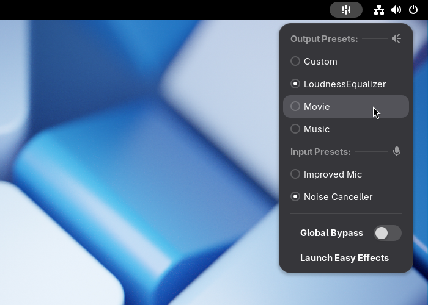

[](https://extensions.gnome.org/extension/4907/easyeffects-preset-selector/)

<p align="center">

</p>

<h1 align="center">EasyEffects Preset Selector GNOME Extension</h1>

<p align="center">A GNOME Shell Extension to quickly show and load EasyEffects Presets from top panel</p>

## Overview

[EasyEffects](https://github.com/wwmm/easyeffects) (formerly known as PulseEffects) is a GTK4 application to apply multiple filters and audio effects to your audio inputs (microphone) and outputs (speaker, headphone etc.). It lets users to download [community presets](https://github.com/wwmm/easyeffects/wiki/Community-presets) or create their own. Installed presets can be viewed and selected from EasyEffect GUI or using terminal commands.

This GNOME Extension lets users to quickly view and select the preset they want right from the GNOME Shell Status Bar without opening the EasyEffects App or typing commands on the terminal.

<p align="center">
    
</p>

## Installation

### Dependencies

This Extension depends on EasyEffects to function. It makes use of command-line options `easyeffects -p` and `easyeffects -l`.

Both Flatpak and non-flatpak versions of EasyEffects are supported.

#### ❗ **Important:**

To fix some of the common problems you might possibly have after installing the extension, **make sure that** you have:

- installed [EasyEffects](https://github.com/wwmm/easyeffects),
- run EasyEffects app at least once before,
- Optionally but pragmatically;
  - **disabled** the option for EasyEffects to **"Shutdown on Window Closing"**
  - and **enabled** **"Launch Service at System Startup"** in the EasyEffects' Preferences menu,
- [installed and/or created some Presets](https://github.com/wwmm/easyeffects/wiki/Community-presets) in the EasyEffects app,
- loaded a preset at least once **using the EasyEffects app**,

🔄 Also try **rebooting** your system **after a fresh install of EasyEffects** to prevent or fix some possible issues.

### Install From GNOME Extensions Website

[](https://extensions.gnome.org/extension/4907/easyeffects-preset-selector/)

- To be able to install extensions from extensions website, you need to have:

    1. `gnome-browser-connector` package (from your package manager)
    2. GNOME Shell Integration add-on for your browser - [for chromium](https://chrome.google.com/webstore/detail/gnome-shell-integration/gphhapmejobijbbhgpjhcjognlahblep) , [for firefox](https://addons.mozilla.org/tr/firefox/addon/gnome-shell-integration/)

- Note: Because of the review process, new versions on the GNOME Extensions Website may lag a few days behind sometimes.

### Versions

Extensions developed for GNOME 45+ is incompatible with older GNOME versions and vice-versa. If you use GNOME Extensions Website or some application like Extension Manager it should install the latest compatible version for your GNOME version. But if you'll install it from source you should pick the one that is compatible with your GNOME version.

| Branch | Version | Compatible GNOME Version |
| ------ | ------- | ------------------------ |
| master | v27     | GNOME 45 +               |
| legacy | v28     | GNOME 3.38 ... GNOME 44  |

### Installation From source

1. Clone the repository:

    ```sh
    git clone https://github.com/ulville/eepresetselector.git
    ```

    ```sh
    cd eepresetselector
    ```

2. If you need a specific version rather than the master branch:

    ```sh
    git checkout <tag-or-branch>
    ```

    Replace `<tag-or-branch>` with the version's tag name e.g. `git checkout v17` or a branch name e.g. `git checkout legacy`

3. Run install script:

    ```sh
    make
    ```

4. Log out and login.
5. Enable the extension from GNOME Extensions app.

### Install Presets

- You can find all the information [here](https://github.com/wwmm/easyeffects/wiki/Community-presets)

## Language Support

The extension shows 'Output Preset' and 'Input Preset' title names as parsed from the output of EasyEffects' command-line interface so it already comes in the system language (If supported by EasyEffects).

<p align="center">
    
</p>

For notifications and preferences we need translations. Available translations are:

- Turkish

## Translators

### To add a new language

1. Create an up-to-date template file:

    ```sh
    make pot
    ```

2. Open it using your favorite PO editor e.g. "Poedit". Create a translation from it for your language, make your changes and save it as a .po file in `./locale` directory.
3. Remove the .pot file

### To improve an existing translation

1. Update translatable messages by running

    ```sh
    make translations
    ```

2. Edit the PO file you want to work on using your favorite PO editor and save.

## Contributors

### Coding Style

I use **ESLint 8** and a custom eslint config specifically created for GNOME Shell Extensions. Please use eslint to format your code before committing.

Install eslint to the project directory (this uses `package.json` to install needed eslint version and its dependencies)

```sh
npm install
```

To check eslint warnings

```sh
npx eslint -c .eslintrc.yml <filename.js>
```

To fix issues automatically

```sh
npx eslint --fix -c .eslintrc.yml <filename.js>
```

Or you can integrate eslint with your editor of choice. For VSCode I use the official [ESLint Extension](https://marketplace.visualstudio.com/items?itemName=dbaeumer.vscode-eslint) from Microsoft.
